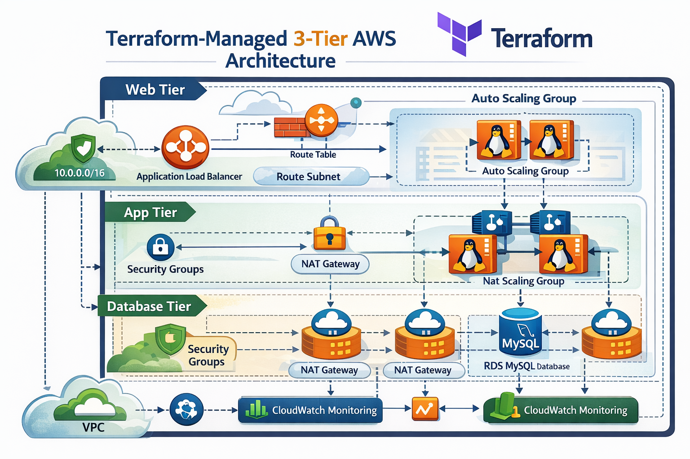

  

🚀 3-Tier Architecture on AWS using Terraform

This project provisions a production-ready 3-tier architecture on AWS using Terraform modules for better reusability, scalability, and maintainability.

The infrastructure follows best practices for high availability, security, and auto scaling.

🏗 Architecture Overview

This 3-Tier Architecture consists of:

🌐 1️⃣ Networking Layer (modules/networking)

VPC
Public Subnets
Private Subnets
Internet Gateway
NAT Gateway
Route Tables
Security Groups

🖥 2️⃣ Application Layer (modules/autoscaling)

Application Load Balancer (ALB)
Target Group
Launch Template
Auto Scaling Group
EC2 Instances
IAM Roles

🗄 3️⃣ Database Layer (modules/database)

RDS MySQL Instance
DB Subnet Group
Private Subnet Deployment
Security Group for RDS

📂 Project Structure:

3-TIER-ARCHITECTURE/
│
├── modules/
│   ├── networking/
│   ├── autoscaling/
│   └── database/
│
├── main.tf
├── variables.tf
├── terraform.tfvars
├── outputs.tf
├── providers.tf
├── versions.tf
├── .terraform.lock.hcl
├── .gitignore
├── LICENSE
└── README.md

⚙ Tools & Technology Used:

Terraform
AWS
EC2
Auto Scaling
RDS
ALB
IAM
CloudWatch

⚙ Prerequisites:

Make sure you have:
AWS Account
AWS CLI configured (aws configure)
Terraform installed (>= 1.x)
Proper IAM permissions to create AWS resources

🚀 How to Deploy:

terraform init
terraform validate
terraform plan
terraform apply
terraform destroy (To avoid AWS charges)

🔐 Security Best Practices Implemented:

RDS deployed in private subnets
EC2 instances in private subnets
ALB in public subnets
Security group-based access control
Modular structure for better isolation
IAM roles instead of hardcoded credentials

📈 High Availability & Scalability:

Multi-AZ deployment
Auto Scaling Group for web tier
Load balancing across multiple EC2 instances
NAT Gateway for secure outbound internet access

🌟 Why Modular Terraform?

Using modules provides:

Reusability
Clean project structure
Easier maintenance
Scalability for production workloads
Separation of concerns